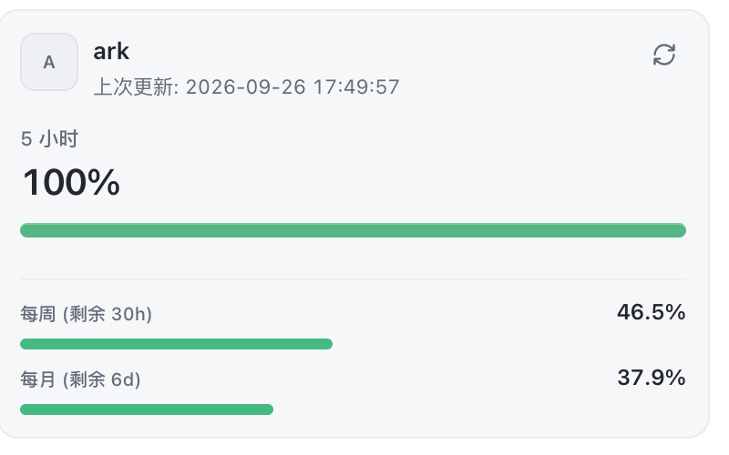

<div align="center">

# ccr-volcengine-coding-plan-usage

**Volcano Engine Coding Plan usage for Claude Code Router**

Show your Volcano Engine Coding Plan quota — 5-hour, weekly, and monthly windows — on the account usage card of the `ark` provider in [Claude Code Router](https://github.com/musistudio/claude-code-router).

[English](./README.md) | [简体中文](./README.zh-CN.md)

[](https://github.com/jiaquanchou/ccr-volcengine-coding-plan-usage/actions/workflows/test.yml)
[](./LICENSE)




</div>

This is a community plugin, not affiliated with Volcano Engine or Claude Code Router. It calls the official **Ark CLI** on your machine and never stores any key or login state itself.

## Features

- **Three quota windows** — 5-hour, weekly, and monthly — with remaining percentage and reset time on one card.
- **Color-coded status** — `ok`, `warning` (lowest window ≤ 20%), `critical` (≤ 5%).
- **No credential handling** — authentication lives entirely in the official Ark CLI's own login; the plugin only reads its JSON output.
- **Zero npm dependencies** — Node built-ins only, six unit tests.
- **Works inside CCR's Electron gateway** — automatically survives CCR's restricted-PATH environment (see [How it works](#how-it-works)).

## Requirements

- [Claude Code Router](https://github.com/musistudio/claude-code-router) desktop **3.1.1+** (provider-surface plugins with the `provider-account-connectors` permission).
- The official Volcano Ark CLI, installed and logged in:

  ```bash
  CI=1 npm install -g @volcengine/ark-cli   # CI=1 skips auto-installing Agent skills
  arkcli auth login volc-sso
  arkcli auth status                                    # verify the login
  arkcli usage plan --product coding-plan --format json # verify the query works
  ```

## Quick Start

1. Clone this repo anywhere on your machine:

   ```bash
   git clone https://github.com/jiaquanchou/ccr-volcengine-coding-plan-usage.git
   ```

2. In CCR, open **Extensions**, install the cloned directory, enable the plugin, then **fully quit and reopen CCR**.
3. Edit the `ark` provider: enable **Fetch usage**, set **Usage mode** to **Raw connector JSON**, and fill in:

   ```json
   [
     {
       "type": "plugin",
       "pluginId": "volcengine-coding-plan-usage",
       "connectorId": "coding-plan-usage"
     }
   ]
   ```

4. Save, then refresh the provider's account usage — the card should show all three windows.

If your `arkcli` lives outside the default search paths, add `"options": { "binary": "/absolute/path/to/arkcli" }` to the connector object.

## How it works

```text
CCR gateway (Electron, restricted PATH)
  └─ plugin connector resolve
      └─ locate arkcli via PATH + common install dirs (/opt/homebrew/bin, /usr/local/bin, …)
          └─ node-shebang script → execute with the host runtime (ELECTRON_RUN_AS_NODE=1)
              └─ arkcli usage plan --product coding-plan --format json
```

### The PATH gotcha

CCR's gateway is a GUI process whose `PATH` is deliberately restricted (its own bin dir plus system directories — no `/opt/homebrew/bin`). `arkcli` is a Node script with a `#!/usr/bin/env node` shebang, so executing it directly from the gateway fails with exit 127: **the same query works fine in your terminal but always fails in the UI**.

The plugin handles this on its own: it locates the CLI through `PATH` plus common install dirs, and when the target is a Node script it executes the script with the gateway's own runtime (`process.execPath` + `ELECTRON_RUN_AS_NODE=1`) instead of relying on `env node`.

## Updating an installed plugin

The repo directory is the source; CCR's extension directory is a runtime copy. After pulling changes, sync with:

```bash
./install.sh --dry-run   # preview
./install.sh             # syncs index.cjs and plugin.json, leaving timestamped backups
```

Then fully quit and reopen CCR.

## Development

```bash
node --test test.cjs
```

| File | Purpose |
| --- | --- |
| `index.cjs` | Connector: CLI lookup, spawn strategy, usage parsing |
| `test.cjs` | Unit tests for parsing and the spawn strategy |
| `install.sh` | Sync source files into CCR's extension directory |
| `plugin.json` | Plugin manifest (id, surfaces, permissions) |

## Compatibility

Tested on **macOS · CCR 3.1.1 · `@volcengine/ark-cli` 1.0.36** (personal Coding Plan edition). Linux should work via `PATH` or `options.binary` but is untested — reports welcome. Team-edition plans are filtered out; only personal editions are shown.

## FAQ

**The card shows "Ark CLI usage query failed". What now?**
Run `arkcli auth status` in a terminal to check the login, and `arkcli usage plan --product coding-plan --format json` to check the query itself. The card's error includes the exit code — `127` usually means the CLI or Node.js runtime was not found, not an auth failure.

**Where are my credentials stored?**
In Ark CLI's own configuration on your machine. The plugin never reads, stores, or transmits keys or tokens.

**Does it consume my quota?**
No. Usage queries go through the Ark CLI's management APIs, not the model endpoint.

## References

- [CCR extensions configuration](https://github.com/musistudio/claude-code-router/blob/75e9e750c134acc389eab00bc131c6cd625ba614/docs/src/content/docs/zh/configuration/extensions.md)
- [CCR provider usage connectors](https://github.com/musistudio/claude-code-router/blob/75e9e750c134acc389eab00bc131c6cd625ba614/docs/src/content/docs/zh/configuration/providers.md)
- [Ark CLI usage plan reference](https://github.com/volcengine/ark-cli/blob/daa24759793f6db7c888bf5bdb61990e0c8e249b/skills/arkcli-usage/references/arkcli-usage-plan.md)

## Contributing

Issues and pull requests are welcome. Please run `node --test test.cjs` before submitting.

## License

[MIT](./LICENSE)
